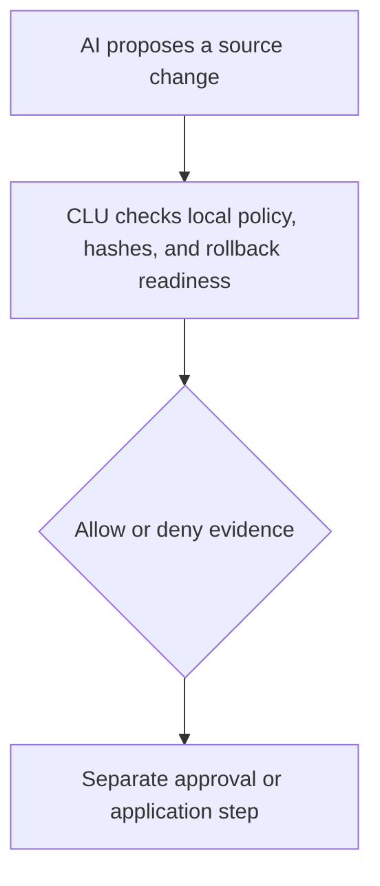
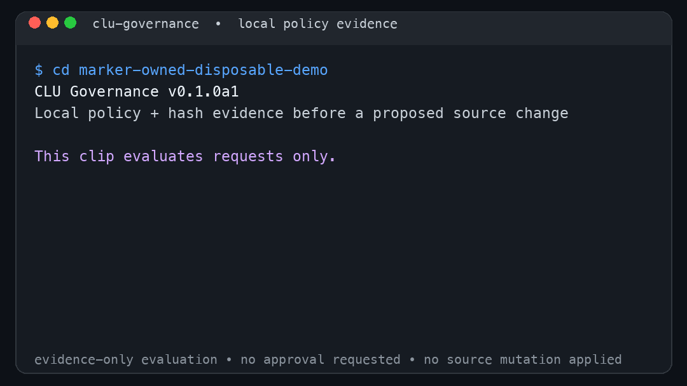

# CLU Governance

[](https://github.com/ArjiaTechnologies/clu-governance/actions/workflows/ci.yml)
[](https://github.com/ArjiaTechnologies/clu-governance/releases/tag/v0.1.0a1)
[](https://www.python.org/downloads/release/python-3120/)

**CLU stands for Cognitive Layer Utility.**

**A local policy and evidence gate for AI-proposed source changes.** CLU Governance evaluates a proposed mutation against local policy, binds the request and evidence with hashes, checks rollback readiness, and produces an `allow` or `deny` result before a separate approval or application step.

It is for developers experimenting with a deliberate control point between a coding agent and a repository mutation. The core CLI is the primary pre-alpha product: it runs locally, has zero runtime dependencies, and provides deterministic policy, hash, approval-separation, rollback-readiness, and evidence workflows.

AI proposes a source change → CLU verifies policy, hashes, and rollback-readiness → CLU produces allow/deny evidence → A separate approval or application step may follow.



> An `allow` result means only that a request is eligible for a separate approval decision. It does **not** authorize, apply, stage, commit, or push a mutation.

## 15-second evidence-only demo



This short recording evaluates two requests in a disposable demo workspace: a documentation-only `README.md` change and a delete request for `clu/danger.py`. It shows the resulting local policy evidence and rollback-readiness signal only. It does not invoke approval or execution, and it does not authorize or apply a source mutation.

## Why CLU?

Coding agents propose changes. CLU does not replace them or decide whether a change is desirable. It supplies a local, deterministic policy-and-evidence checkpoint before another tool or person considers applying a mutation.

- **Policy first:** evaluate a structured source-mutation request against a deny-by-default local policy.
- **Evidence attached:** bind requests, proposals, policies, source state, decisions, and rollback evidence with hashes.
- **Approval stays separate:** eligibility is not approval, and approval is not application.
- **Local by default:** the core CLI and demo require no provider credentials, Docker, database, or network runtime call.

## Try it locally

Use Python 3.12, clone the repository, and run the deterministic demonstration in a local environment you control:

```bash
git clone https://github.com/ArjiaTechnologies/clu-governance.git
cd clu-governance
python3.12 -m venv .venv
. .venv/bin/activate
python -m pip install .
clu-governance demo-run-all --json
```

The demo evaluates one documentation-only request as eligible and one delete request as denied. It also verifies rollback readiness. The expected signals include:

```text
allow: eligible_for_human_approval
deny:  delete_operation_denied
rollback_readiness_verified: true
```

The built-in demo uses its own marker-owned temporary repository to prove application and rollback; it does not mutate your checkout. Run `clu-governance protected-source-manifest --json` to inspect the exact protected-source manifest for your installation.

The project is not yet published on PyPI; the command above intentionally installs from a local checkout. The documented development workflow is the standard setuptools editable install:

```bash
python -m pip install -e .
clu-governance protected-source-manifest --json
```

This release candidate validates that standard command. It does not claim support for every editable backend or every `--no-build-isolation` layout. Where those tools are available, local tool installation can also use `pipx install .` or `uv tool install .`.

## What it can do today

- Evaluate structured source-mutation requests against a deny-by-default local policy.
- Bind requests, proposals, policies, source state, decisions, and rollback evidence with hashes.
- Keep policy eligibility separate from approval and application.
- Run a deterministic local allow/deny demonstration and prove rollback inside its temporary workspace.
- Report an exact protected-source manifest for source, standard setuptools editable, and wheel installs.
- Verify a locally generated Git-adapter bundle at the current location and time.

For command arguments and JSON contracts, see the [CLI contract](docs/cli-contract.md). To inspect the policy and request fixtures directly, see [examples](examples/README.md).

## Who this is for

CLU Governance is most useful to developers who are experimenting with AI coding agents and want to test a narrow local control point before source changes are approved or applied. It is not an AI coding agent, a hosted governance service, or a production security boundary.

## Feedback wanted

This is a public pre-alpha. We especially want reports about:

- onboarding failures on a clean Python 3.12 environment;
- policy examples or source-mutation requests you cannot express;
- the first coding-agent integration you would try; and
- unclear limits, terminology, or evidence output.

Open an [issue](https://github.com/ArjiaTechnologies/clu-governance/issues) for product and documentation feedback. For security-sensitive reports, follow the [security policy](SECURITY.md). Contributions are welcome through [CONTRIBUTING.md](CONTRIBUTING.md).

## Pre-alpha boundaries and current limits

> **Pre-alpha:** `0.1.0a1` is for experimentation and integration work. It is not an enterprise security guarantee, authenticated identity system, non-bypassable enforcement layer, immutable audit store, or guarantee that a rollback will succeed outside the documented demo.

> **Experimental Git adapter:** `git-adapt` is experimental and intended for trusted local repositories in single-user workflows. It is not a sandbox and does not defend against a malicious Git executable, hostile local process, operating-system administrator, concurrent same-user filesystem modification, or tampering after point-in-time verification.

Under the documented workflow, source code and generated artifacts remain local. CLU Governance does not claim production readiness, market readiness, authenticated approval, verified human presence, tamper-evident storage, immutable bundles, full-repository governance, universal cross-platform Git-adapter support, independent security validation, customer validation, or competitive superiority. See [claims and limitations](docs/claims-and-limitations.md) and [security boundaries](docs/security-boundaries.md).

## Documentation

- [Quick start and supported installation modes](docs/quickstart.md)
- [CLI contract](docs/cli-contract.md)
- [Source-mutation policy gate](docs/source-mutation-policy-gate.md)
- [Experimental Git adapter](docs/git-diff-adapter.md)
- [Security boundaries](docs/security-boundaries.md)
- [Development methodology](docs/development-methodology.md)
- [Engineering decisions](docs/engineering-decisions.md)
- [Contributing](CONTRIBUTING.md)
- [Security policy](SECURITY.md)

## License

Apache License 2.0. See [LICENSE](LICENSE).
